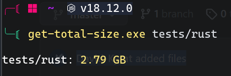

# Get Total Size

Very short cross-platform cli app to get the total size of folder and output it in a nice way.

**Exemple :** 




### Usage

```bash
git clone https://github.com/David-Kyrat/get-total-size.git <where_you_want>
cd <where_you_want>
cargo build --release
```

Executable is in `target/release`
